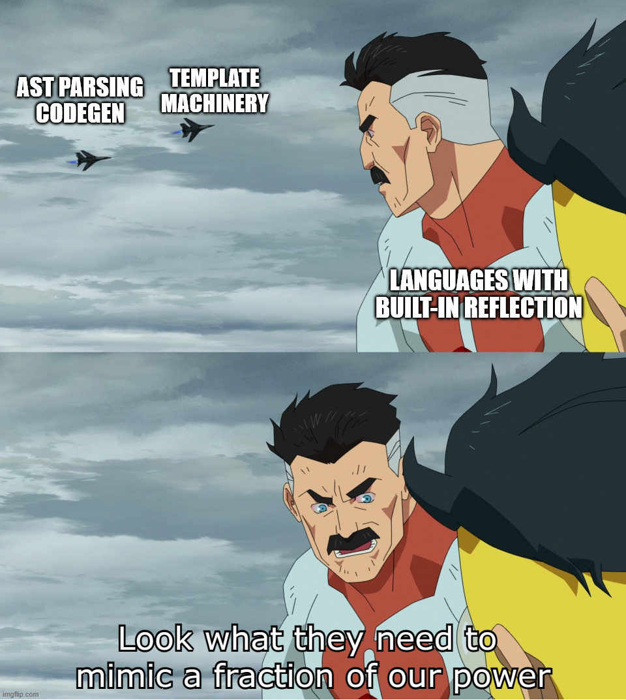

# Omnirefl

<p align="center">
  
  <br>
  <sub>Obligatory self-reflection meta joke.</sub>
</p>

A C++ reflection tool built for a seamless experience without macros or UB.

## Sneak Peek

Minimal CMake setup:

```cmake
# 3.18.2 is the current project floor for CMake APIs used by the package and
# reflected target integration.
cmake_minimum_required(VERSION 3.18.2 FATAL_ERROR)

project(example LANGUAGES CXX)

find_package(omnirefl CONFIG REQUIRED)

add_executable(example main.cpp)
set_property(TARGET example PROPERTY CXX_STANDARD 20)

# Reflection is not transitive: only this target's own .cpp files are
# instrumented. Call omni_reflected_target for each target that should be
# reflected.
omni_reflected_target(example)
```

Instrumentation can also be triggered explicitly through `<target>.omni`
(`example.omni` here):

```bash
cmake --build build -t example.omni
```

The same target shape is used by
[tests/tool/example/CMakeLists.txt](tests/tool/example/CMakeLists.txt).

`omni_reflected_target(...)` is a convenience wrapper; omnirefl itself does not
require CMake. An equivalent direct invocation is:

```bash
# Generate the reflection header, then force-include it when compiling the same
# translation unit.
flags="-std=c++20 -I/path/to/omnirefl/include"
omnirefl -o example.omnirefl.hpp -c main.cpp -- c++ $flags
c++ $flags -include example.omnirefl.hpp main.cpp -o example && ./example
```

`-c` selects the instrumented source; compiler output options after `--` are
ignored. When a compilation database is available, `ccdb_query` can select its
matching compiler command for use after `--`.

```cpp
#include <omnirefl/reflection.hpp>

#include <iostream>
#include <string>
#include <string_view>
#include <tuple>

struct record {
  int foo;
  std::string bar;
};

int main() {
  using namespace std::string_view_literals;

  record value{
    .foo = 1,
    .bar = "before",
  };

  std::cout << "before: foo=" << value.foo << " bar=" << value.bar << '\n';

  const auto write = [](omni::binding auto b)
    // Generic lambdas used as reflected visitors must spell the return type.
    -> void {
      std::apply(
        [](omni::field_binding auto... field) -> void {
          const auto set = [](omni::field_binding auto field) -> void {
            constexpr std::string_view name = field.name();

            if constexpr ("foo"sv == name)
              field.set_value(8);

            if constexpr ("bar"sv == name)
              field.set_value("after");
          };

          (set(field), ...);
        },
        b.public_fields());
    };

  omni::reflected_call(write, value);

  std::cout << "after: foo=" << value.foo << " bar=" << value.bar << '\n';
}
```

The snippet above is available as
[tests/tool/example/main.cpp](tests/tool/example/main.cpp) and is included in
the package.
See [tests/tool/comprehensive_guide/comprehensive_guide.cpp](tests/tool/comprehensive_guide/comprehensive_guide.cpp)
for the full executable guide. It targets limited C++20 support: omnirefl
concepts are used, but `<concepts>` and C++20 ranges algorithms are avoided.

## Seamless Experience

1. Add `omni_reflected_target(...)` for the CMake target.
2. Use `omni::reflected_call(...)` where reflection is needed.

Everything else remains regular C++. Omnirefl discovers the argument types and
supported dependencies, force-includes the generated header, and emits
compiler-style dependency files (`.d`) so Ninja reruns it when the source or
any included header changes (tested with Ninja only as of this writing). No
macros, compiler-specific UB, or manual regeneration are required.

## Supported Scope

Omnirefl focuses on POD-like records and enums.

- C++11 through C++23; C++20 concepts provide the most ergonomic interface.
- Globally accessible named records and enums.
- Nested named records/enums of supported globally accessible parents.
- Unconstrained primary record templates, including use as CRTP bases.
- Public data fields: names, type names, annotations, value retrieval, mutation
  of writable fields, and `is_const()`/`is_mutable()`/`is_volatile()` traits.
- Enumerator names, values, and annotations.
- Dependency discovery through:
  - public field types
  - public bases and transitive public bases
  - public fields of primary template records
  - supported public member aliases:
    - `error_type`
    - `first_type`
    - `key_type`
    - `mapped_type`
    - `second_type`
    - `type`
    - `value`
    - `value_type`
  - template-pack routes named `tuple` or `variant`
- Standard-library record types are not traversed as reflectable records
  outside those protocol routes.

### Limits

- `reflected_call` is the instrumentation boundary. The visitor must be either
  a generic lambda or a type with a templated `operator()`. Its return type must
  not depend on instantiating the visitor body during the tool run; for lambdas,
  this means an explicit trailing return type, including `-> void`.
  `constexpr auto result = reflected_call(...)` is not supported: it forces
  evaluation and breaks that instrumentation boundary.
- `reflected_call` accepts reflected records and enums only. The caller must
  sanitize pointers, arrays, and compound inputs before the call; use
  `std::visit` or `mpark::visit` for variants. Compound types remain valid
  dependency routes as listed above. Invalid-input detection is best effort.
- Constrained primary record templates are not supported. The force-included
  generated header would have to repeat equivalent constraints before their
  source-level dependencies are declared, and concepts cannot be
  forward-declared.
- Direct recursive `reflected_call` is not supported inside a reflected scope.
  A nested reflection call can only work if that reflected path was already
  instantiated independently.
- Reflection queries are valid only inside the reflected scope. The tool reports
  out-of-scope queries as errors on a best-effort basis.
- Public data members only. Private/protected fields are skipped, including
  fields inherited through public bases. Member functions are not reflected.
- Local and unnamed types are not supported. Experimental indexed support exists
  for investigation (`omni_reflected_target(... ENABLE_INDEX_MODE)`), but is
  not part of the release contract: it has proven unstable because function
  template specializations are instantiated lazily, and a dependent return type
  can postpone instantiating the function body until the specialization is
  required.
- CMake-generated sources are skipped by default. Targets commonly contain
  helper translation units such as Qt moc output, which must not be
  instrumented; explicit opt-in for generated sources is not available yet.
- The CMake wrapper only instruments concrete C++ source entries. Source
  generator expressions such as this are not supported:

  ```cmake
  target_sources(example PRIVATE
      "$<$<CONFIG:Debug>:${CMAKE_CURRENT_SOURCE_DIR}/debug.cpp>")
  omni_reflected_target(example)
  ```

  CMake resolves the selected source while generating the buildsystem, after
  `omni_reflected_target()` has configured each source's generated header and
  force-include option. Those source properties cannot be attached to the
  resolved path retroactively.
- C translation units are ignored; if no C++ source remains, reflection is
  skipped with a configuration warning.

Linters and language servers such as clangd can report temporary "ghost"
diagnostics between edits/tool runs, because reflected `.cpp` files depend on
the generated header that is force-included during normal compilation. Build
the affected `.cpp` file normally, or refresh its metadata explicitly through
the `<target>.omni` CMake target.

During AST creation, invalid C++ in the reflected translation unit is reported
as Clang compilation errors. Compiler warnings are not reported by omnirefl.

## Install

Install options:

- Latest release:
  [download the packaged archive for your platform](https://github.com/sergio-eld/omnirefl/releases/latest).
  Linux packages are published as `.deb` and `.tar.gz`; Windows packages are
  published as `.zip`.
- Latest CI artifact:
  open the latest successful
  [`CI` workflow](https://github.com/sergio-eld/omnirefl/actions/workflows/ci.yml)
  run on `master` and use the artifacts produced by
  `Build package / linux-x86_64` or
  `Build package / windows-x86_64`. GitHub Actions artifacts do not provide a
  stable direct "latest artifact" download URL; look for
  `packages-linux-x86_64-musl-<short-sha>` or
  `packages-windows-x86_64-ucrt-<short-sha>`.
- Build locally using the prepared Docker image; see
  [Build and Develop Locally](#build-and-develop-locally).

The examples below assume a standard install under `/usr/local`.

## Packaged Tests and Examples

Assuming a standard install, the packaged test/example sources are available
under `share/omnirefl/tests`. Copy them into a writable directory before
configuring:

```bash
prefix=/usr/local # Or the unpacked install root.
cp -R "$prefix/share/omnirefl/tests" ./omnirefl-tests

mkdir build && cd build

cmake ../omnirefl-tests -GNinja

ctest --output-on-failure
```

The copied tree also contains the runnable example and comprehensive guide
sources. The tests fetch their own test-only dependencies during CMake
configuration. If CMake cannot find omnirefl in a non-standard install, pass
`-Domnirefl_DIR="$prefix/lib/cmake/omnirefl"`; on Windows this is usually needed
for an unpacked `.zip` package.

## Build and Develop Locally

The repository uses the
[`ghcr.io/sergio-eld/omnirefl-build-alpine-x86_64-musl-ucrt`](https://github.com/sergio-eld/omnirefl/pkgs/container/omnirefl-build-alpine-x86_64-musl-ucrt)
Alpine Docker image for local and CI builds. The image contains prebuilt
LLVM/Clang installs for both Linux and Windows targets; building that layer
from source can take close to an hour, so using the prepared image is the
simplest way to get reproducible local and CI builds. The image is defined by
[docker/build-alpine-x86_64-musl-ucrt.Dockerfile](docker/build-alpine-x86_64-musl-ucrt.Dockerfile).

The same Alpine image is used for the MinGW Windows cross-build. The Linux tool
build uses static musl linking, so the packaged executable has no runtime libc
dependency on the target Linux distribution. The Windows package targets UCRT;
no other runtime dependency is expected.

If configuring the build directly on the host instead of using the image, use a
C++23 compiler. As of now, the prepared build image uses GCC for the native
Linux tool build.

Build Linux and Windows packages:

```bash
docker compose run --rm build-linux
docker compose run --rm build-windows
```

The packages are written to `artifacts/packages/linux` and
`artifacts/packages/windows`. To work inside the same build image:

```bash
docker compose run --rm --entrypoint /bin/ash build-linux
```

## Examples

- [tests/tool/example/main.cpp](tests/tool/example/main.cpp) is the small
  runnable README example.
- [tests/tool/comprehensive_guide/comprehensive_guide.cpp](tests/tool/comprehensive_guide/comprehensive_guide.cpp)
  is the executable usage guide with C++20, compatibility, dependency,
  template, annotation, schema, and write examples. It is written for limited
  C++20 support and avoids `<concepts>` plus C++20 ranges algorithms.

## Tested Toolchains

Current package/install coverage is reported by the
[CI workflow](https://github.com/sergio-eld/omnirefl/actions/workflows/ci.yml).

- (+) `Linux:Alpine GCC` covered by CI package matrix
- (+) `Linux:Alpine Clang` covered by CI package matrix
- (+) `Linux:Alpine MinGW GCC` covered by CI package matrix
  (build-only for Windows test binaries)
- (+) `Linux:Ubuntu 18.04 GCC` covered by CI package matrix
- (+) `Linux:Ubuntu 18.04 Clang` covered by CI package matrix
- (+) `Linux:Ubuntu 20.04 GCC` covered by CI package matrix
- (+) `Linux:Ubuntu 20.04 Clang` covered by CI package matrix
- (+) `Linux:Ubuntu 22.04 GCC` covered by CI package matrix
- (+) `Linux:Ubuntu 22.04 Clang` covered by CI package matrix
- (+) `Linux:Ubuntu 18.04/20.04/22.04 MinGW GCC` covered by CI package matrix
  (build-only for Windows test binaries)
- (+) `Windows:MSVC` covered by CI package matrix
- (+) `Windows:clang-cl` covered by CI package matrix
- (+) `Windows:MSYS2 MinGW` covered by CI package matrix
- (+) `Windows:MSYS2 clang` covered by CI package matrix
- TODO(High): cross-build the tool for `macOS`.
- TODO(High): cross-build the tool for `ARM64` targets.
- TODO(High): investigate switching the tool build to Cosmopolitan after a
  baseline benchmark is in place.

## Is It Slow?

Omnirefl uses a Clang frontend action: it preprocesses the translation unit and
builds its AST, but does not perform object-code optimization or code
generation. Frontend work commonly accounts for around 30% of a complete object
build, although the ratio depends on the source, included headers, compiler, and
optimization level.

The [benchmark baseline](tests/tool/baseline_test.cpp) is intentionally large
enough to represent a meaningful translation unit and contains a reasonable
amount of ordinary and reflected code. As of this writing, its complete
omnirefl run takes about 20-25% of the subsequent Release object build in CI.
These percentages are relative to the object build alone: a five-second
compilation gains roughly one additional second when instrumentation runs,
which is generally negligible at whole-build scale.

Only instrumented targets pay this cost, and reflected translation units can be
isolated in dedicated targets. The impact is therefore most noticeable during
initial generation. Omnirefl emits dependency files for the source and all its
included headers, so Ninja reruns instrumentation only when one of those inputs
changes. See the [continuous benchmark](#continuous-benchmark) for measured
stages and regression tracking.

## Continuous Benchmark

Benchmark runs are reported by the
[CI workflow](https://github.com/sergio-eld/omnirefl/actions/workflows/ci.yml).

- Target: `linux-x86_64`
- Environment: Ubuntu 22.04 GCC package-test image
- Baseline target: `benchmark.baseline`
- Raw history artifact: `benchmark-history-linux-x86_64-gcc`
- Reported baseline: average of the last 5 stored runs
- Tracked metrics:
  - reflection/tool wall time for `benchmark.baseline.omni`
  - build wall time for `benchmark.baseline`
  - reflection/tool wall time as percentage of build wall time
- Regression warnings require an increase above 20% for reflection wall time
  or the tool/build percentage; wall time also requires at least a 500 ms
  increase. Internal stage and build timings are retained as diagnostic detail.
- TODO: when the repository goes public, render or link the benchmark history
  directly from the README instead of requiring artifact lookup.

## Release Scope

### Minimal Release

#### Types

- (+) named globally accessible records
- (+) named globally accessible enums
- (+) nested named records/enums of supported globally accessible parents
- (+) primary record templates with type, value, and template-template
  parameters, including use as CRTP bases

#### Records

- (+) public data fields
- (+) read public fields
- (+) write public writable fields, including mutable fields through const
  bindings
- (+) inherited public fields
- (+) transitive public base fields
- (+) multiple public base fields
- (+) public base fields from template records
- (+) private/protected base fields are not reflected through derived records
- (+) non-public fields are not reflected
- (+) field names
- (+) field types
- (+) field `type_name()` without namespaces, including enclosing records when
  available
- (+) field `qualified_type_name()` preserves source declaration spelling when
  available
- (+) canonical metadata is available when the field type itself is reflectable
- (+) field `is_const()`, `is_mutable()`, and `is_volatile()` traits
- (+) field count / iteration
- (+) field index is local to the declaring record, not the flattened inherited
  field tuple
- (+) record `type_name()` without namespaces, including enclosing records
- (+) record `qualified_type_name()` with namespaces and enclosing records

#### Enums

- (+) enumerator names
- (+) enumerator values
- (+) scoped enums
- (+) fixed-underlying enums
- (+) enum `type_name()` without namespaces
- (+) enum `qualified_type_name()` with namespaces
- (-) plain unscoped enum field dependencies cannot be forward-declared

#### Dependency Routes

- (+) public field type dependencies
- (+) public base type dependencies
- (+) transitive public base dependencies
- (+) standard-library public bases are ignored as reflection dependencies
- (+) public field dependencies of primary template records
- (+) supported public member alias dependencies: `error_type`, `first_type`,
  `key_type`, `mapped_type`, `second_type`, `type`, `value`, `value_type`
- (+) `std::pair` dependencies through `first_type` and `second_type`
- (+) supported template-pack dependencies for template names exactly `tuple`
  and `variant`
- (+) `std::` record types are ignored outside the supported protocol routes
- (+) recursive dependency walk through supported routes

#### Serialization Completeness

- (+) reflect record field names
- (+) reflect record field types
- (+) reflect record field type names and qualified type names
- (+) reflect record and field annotations
- (+) reflect documentation comment annotations from `///`, `//!`,
  `/** */`, `/*! */`, `///<`, and `//!<`
- (+) read field values
- (+) write field values
- (+) write inherited public field values
- (+) reflect enum names
- (+) reflect enum values
- (+) reflect enum annotations
- (+) recurse into reflected record fields
- (+) recurse through supported dependency routes

#### Frontend/API

- (+) `reflected_call` as the supported reflection instrumentation interface
- (+) `meta_t`, `binding_t`, `field_meta_t`, and `field_binding_t` public
  reflection interfaces
- (+) C++20 `meta`, `binding`, `field_meta`, and `field_binding` concepts
- (+) best-effort tool diagnostics for invalid `reflected_call` arguments
  including pointers, arrays, fundamentals, standard-library records, and
  constrained primary templates or explicit/partial template specializations
- (+) best-effort tool diagnostics for reflection query instantiation outside a
  reflected scope

#### Build/Release

- (+) generated-header reflection
- (+) CMake integration
- (+) packaged runnable example and comprehensive guide sources
- (+) annotations enabled by default
- (+) annotations can be disabled with `--no-annotations` or CMake
  `NO_ANNOTATIONS`
- (+) `omnirefl -o <reflection.hpp> -c <source.cpp> -- <compiler command...>`
- (+) helper `ccdb_query <compile_commands.json> <source.cpp> [output-contains]`
  for CMake integration
- (+) Linux and Windows package/install matrices

### Planned After Minimal Release

#### Types

- (-) nested records inside record template parents
- (-) explicit record template specializations
- (-) partial record template specializations
- (-) specialization-specific record template metadata
- (-) specialization-specific CRTP base metadata

#### Metadata

- (-) OpenAPI-like schema table generation from reflected structs/enums using
  type, field, enum, and annotation metadata
- (-) specialization-aware reflected type names when/if explicit or partial
  specializations are implemented

#### Frontend/API

- TODO(High): forbid `reflected_call` inside a reflected scope. With the current
  deferred visitor implementation, reliable detection is not practically
  possible without instantiating visitor bodies or adding a broader semantic
  analysis pass.
- TODO(High): add a CLI option that treats skipped unsupported public bases as
  errors instead of warnings.
- TODO: consider extending reflected entity metadata for fundamental types.
  Currently canonical metadata is available for reflectable record/enum field
  types; fundamental field types are reported only through field declaration
  spelling.
- (-) refine the public interface
- (-) replace `reflected_call`
- (-) separate const and mutable public-field accessors in the public interface
- (-) recoverable reflection query/fallback branch for non-reflected types
- (-) type-erased field wrappers, likely short `field_t`-style names
- (-) refine the CLI interface
- (-) Unix-like invocation: `omnirefl -o <reflection.hpp> -MF <deps.d> -- <cc1 args...>`
- (-) split compiler-driver/compile-db args to cc1 mapping into a separate
  composable tool

### Might Be Considered Later

- (-) unnamed non-local types addressable from namespace scope via
  `decltype(symbol)`
- (-) unnamed non-local types addressable through function return type
- (-) other globally addressable unnamed cases

## Bug Reports

For tool crashes on Linux, please include the command line, stderr/stdout, the
input `.cpp`, the generated header if one was produced, and a backtrace.

```bash
# Enable core dumps for the current shell, then rerun the exact failing command.
ulimit -c unlimited
omnirefl -o out.omnirefl.hpp -c source.cpp -- <compiler command...>

# If your system writes core files into the working directory:
gdb --batch -ex "thread apply all bt full" ./omnirefl ./core > omnirefl.bt.txt

# If your system uses systemd-coredump:
coredumpctl gdb omnirefl --batch \
  -ex "thread apply all bt full" > omnirefl.bt.txt
```

If no core file is produced, check `cat /proc/sys/kernel/core_pattern`; some
systems route core dumps to a crash service instead of the current directory.
